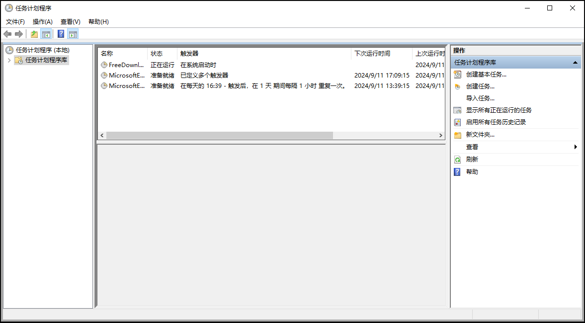
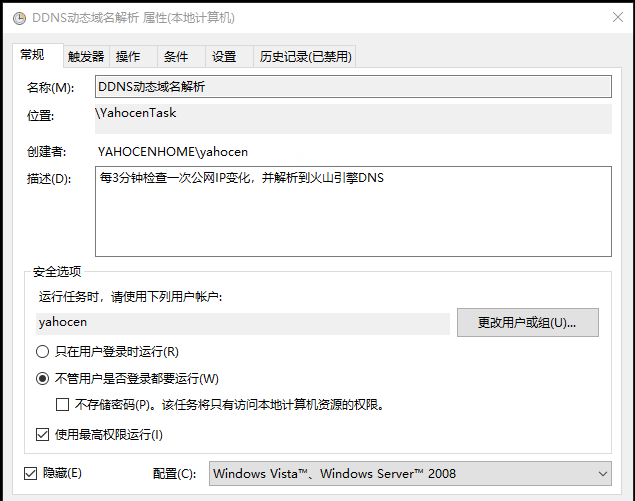
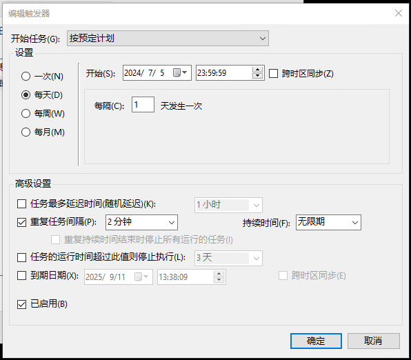
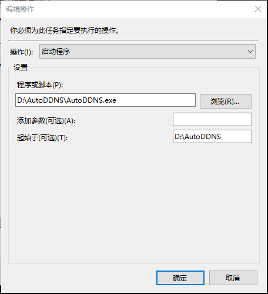

# 在 Windows 中使用任务计划程序设置定时任务

AutoDDNS（简称 ADDNS）是一个动态域名解析系统更新工具。为了确保它能够定期运行并更新域名解析记录，可以通过 Windows 任务计划程序来设置定时任务。以下是详细的步骤说明。

## 步骤

### 1. 打开任务计划程序

1. 在 Windows 搜索框中输入“任务计划程序”，然后点击打开。
2. 或者，按下 `Win + R` 键打开运行对话框，输入 `taskschd.msc`，然后按 Enter 键。

### 2. 创建新的基本任务

1. 在任务计划程序窗口中，点击右侧的“创建基本任务...”。
2. 在“创建基本任务向导”对话框中，输入任务名称（例如：“DDNS动态域名解析”），然后点击“下一步”。

### 3. 设置触发条件

1. 选择触发条件，例如“每天”。
2. 输入任务开始日期和时间。
3. 选择重复任务间隔，例如：2 分钟。
4. 持续时间选择无限期。
5. 勾选已启用。

### 4. 设置操作

1. 选择“启动程序”，然后点击“下一步”。
2. 浏览到 AutoDDNS 的可执行文件路径（例如：`D:\AutoDDNS\AutoDDNS.exe`）。

### 6. 完成设置

1. 检查所有设置，确认无误后点击“完成”。

### 7. 配置高级设置（可选）

1. 若要进一步配置高级设置，如设置任务的优先级、重复尝试次数等，可以在任务列表中找到刚刚创建的任务，右键点击，选择“属性”。
2. 在“属性”对话框中，可以进一步调整任务的各种设置。

通过以上步骤，你就可以成功地在 Windows 中使用任务计划程序设置 AutoDDNS 的定时任务了。
